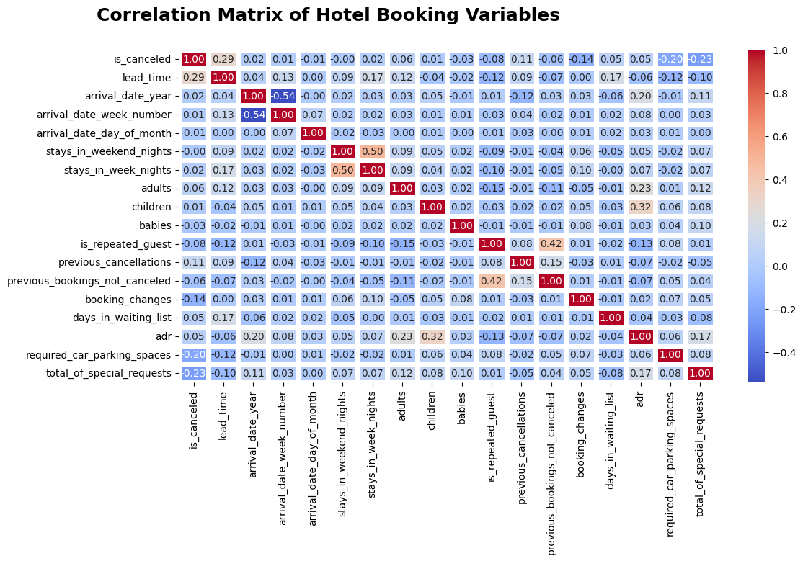
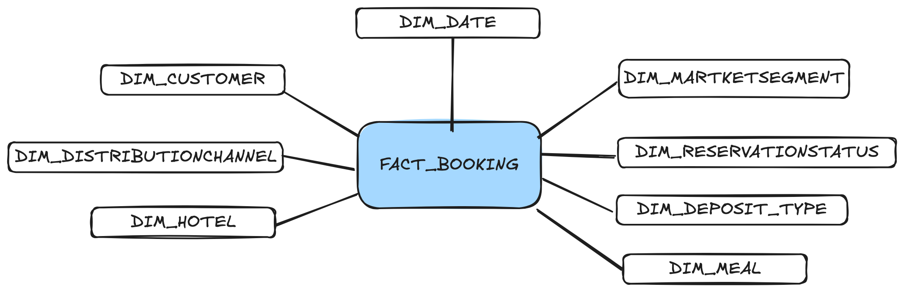
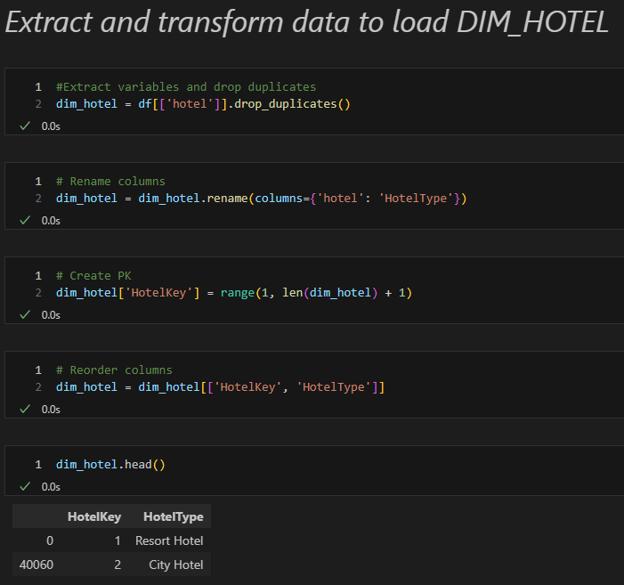
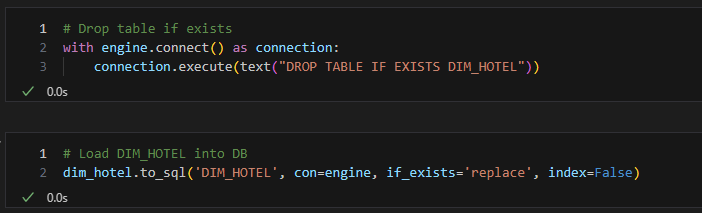
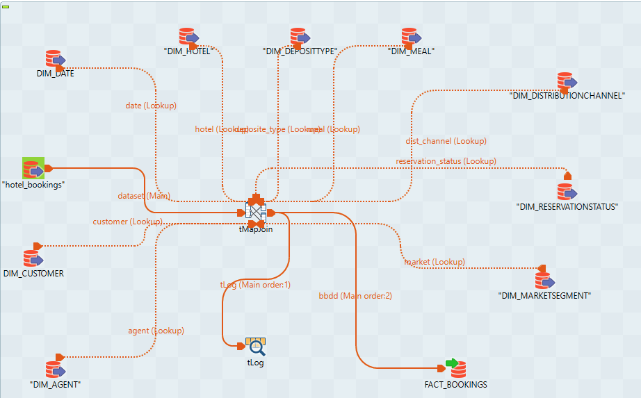
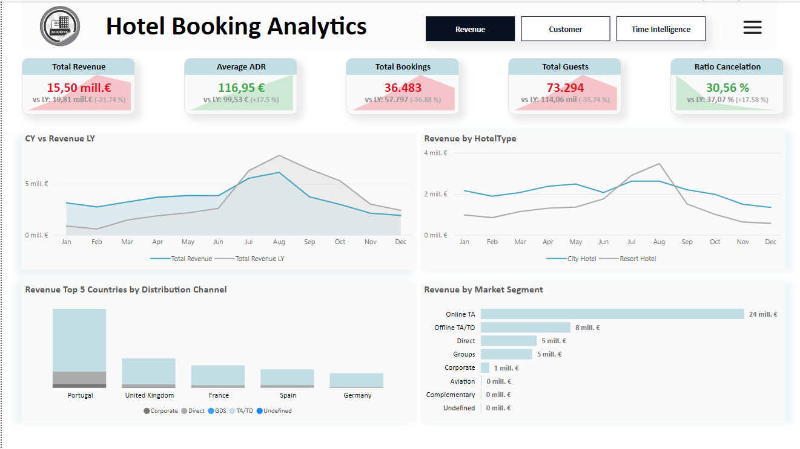

# Proyecto de Análisis de Datos de Reservas de Hoteles

## Descripción del Proyecto
Este proyecto se centra en el análisis de datos del dataset `hotel_bookings.csv`, proporcionando insights valiosos a través de un riguroso proceso de análisis y visualización.

## Contenidos

1. [Análisis Exploratorio de Datos (EDA)](#análisis-exploratorio-de-datos-eda)
2. [Diseño del Diagrama Conceptual](#diseño-del-diagrama-conceptual)
3. [Creación de Tablas](#creación-de-tablas)
4. [Implementación del Esquema Estrella](#implementación-del-esquema-estrella)
5. [Diseño y Desarrollo del Dashboard](#diseño-y-desarrollo-del-dashboard)

## Análisis Exploratorio de Datos (EDA)
El EDA se ha realizado en Python, analizando las variables presentes en el dataset `hotel_bookings.csv`. Este análisis inicial permite identificar patrones y preparar los datos para su posterior modelado.

## Diseño del Diagrama Conceptual
Basado en el análisis de EDA, se ha diseñado un diagrama conceptual que facilita la comprensión y organización de las relaciones entre las diferentes entidades del dataset.

## Creación de Tablas
Se han creado varias tablas para estructurar los datos de manera eficiente:

- **Tablas de Dimensión**: Usando Python para definir las dimensiones clave.
 
 

- **Tabla de Hechos**: Creada con Talend para centralizar los datos relevantes.
 

## Implementación del Esquema Estrella
El esquema estrella se ha implementado en dos plataformas:
- **Base de Datos de Microsoft SQL Server**: Para almacenamiento y gestión de datos.
- **Power BI**: Para la creación de reportes y dashboards.
Además, se ha desarrollado en Power Query para optimizar el proceso de transformación de datos.

## Diseño y Desarrollo del Dashboard
El dashboard se ha diseñado y desarrollado en Power BI, utilizando técnicas avanzadas como:
- **Bookmarks**
- **Calculation Groups**
- **Field Parameters**
- **DAX para crear medidas**

Este enfoque proporciona una visualización dinámica y detallada de los datos, permitiendo a los usuarios explorar y analizar la información de manera interactiva.

---

¡Esperamos que este proyecto proporcione insights valiosos y fomente un mayor entendimiento de los patrones en las reservas de Hoteles!
