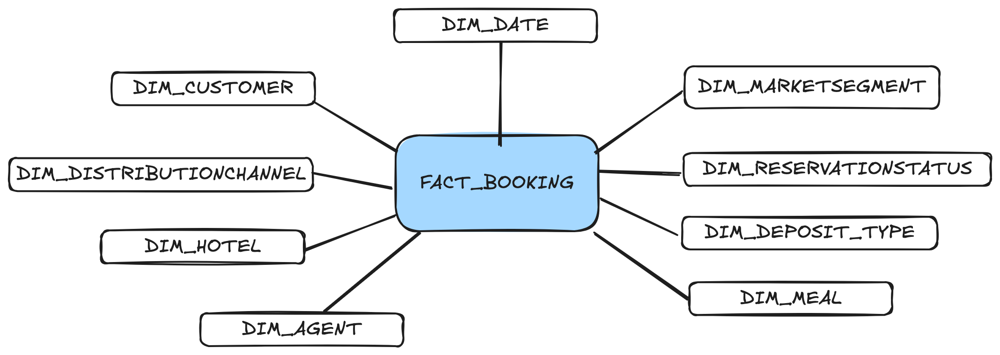

# Hotel Bookings Data Analysis

## Project Description
This project focuses on the analysis of the `HotelBookingDemandDatasets.pdf` article and the `hotel_bookings.csv` dataset, providing valuable information through a rigorous analysis and visualization process.

## Contents
1. [Exploratory Data Analysis (EDA)](#exploratory-data-analysis-eda)
2. [Conceptual Diagram Design](#conceptual-diagram-design)
3. [Table Creation](#table-creation)
4. [Star Schema Implementation](#star-schema-implementation)
5. [Dashboard Design and Development](#dashboard-design-and-development)
6. [PDF Analysis](#pdf-analysis)

## PDF Analysis
The detailed analysis of the `HotelBookingDemandDatasets.pdf` article can be found [here](HotelBookingDemandDatasets.pdf).

## Exploratory Data Analysis (EDA)
The EDA was conducted in Python, analyzing the variables present in the `hotel_bookings.csv` dataset. This initial analysis helps identify patterns and prepare the data for further modeling.

## Conceptual Diagram Design
Based on the EDA analysis, a conceptual diagram was designed to facilitate understanding and organizing the relationships between different entities in the dataset.

## Table Creation
Several tables were created to efficiently structure the data:
- **Dimension Tables**: Using Python to define key dimensions.
   
   
- **Fact Table**: Created with Talend to centralize relevant data.
   

## Star Schema Implementation
The star schema was implemented on two platforms:
- **Microsoft SQL Server Database**: For data storage and management.
- **Power BI**: For reporting and dashboard creation.
Additionally, Power Query was used to optimize the data transformation process.

## Dashboard Design and Development
The dashboard was designed and developed in Power BI, using advanced techniques such as:
- **Bookmarks**
- **Calculation Groups**
- **Field Parameters**
- **DAX for creating measures**

This approach provides a dynamic and detailed visualization of the data, allowing users to explore and analyze the information interactively.

---

I hope this project provides valuable insights and fosters a deeper understanding of patterns in hotel bookings!
